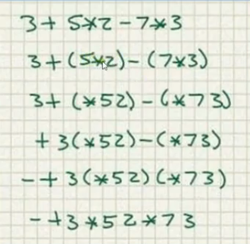
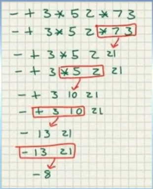
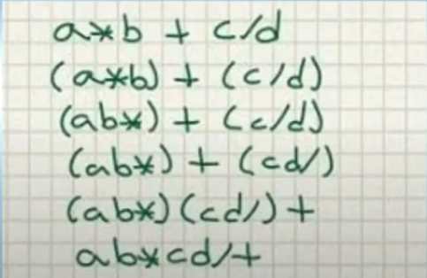
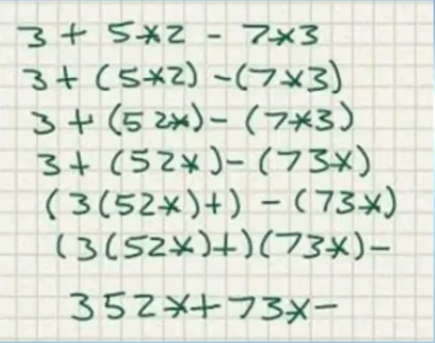
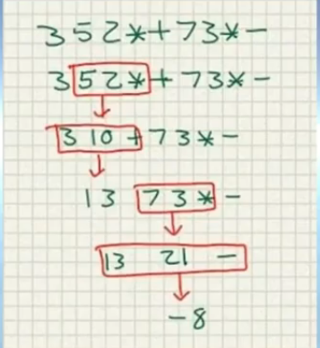

# Prefix
## Convertir Infix a Prefix
> a * b + C / d
> (a * b) + (c / d)
> (*ab) + (/cd)
> +(*ab)(/cd) en prefi no hace falta la agrupacion con parentesis
> +*ab/cd
> otro ejemplo
> 

## Evaluar Expresion en Prefix
> trabajar de derecha a izquierda y recorrer de derecha a izquierda hanta encontrar un operador +-*/ y tomamos los dos operandos que esten mas cercanos a ese operador y se encuentren a su derecha y hacemos la operacion y el resultado de esa operacion sustituye la expresion anterior.
> 

# Postfix

## Infix a Postfix
> El primer paso pero no obligatorio, pero si conveniente es hacer una agrupacion con el fin de evitar ambiguedad que tengamos en la expresion de infix
> agrupar a * b y c/d
> con postfix el operador va a la derecha

## Evaluar expresion en Postfix
> en la evaluacion se trabaja de izquierda a derecha hasta encontrar el operador, en el momento en que se encuentra tomamos los dos operandos mas cercanos y evaluamos, el resultado sustituye la expresion.
>