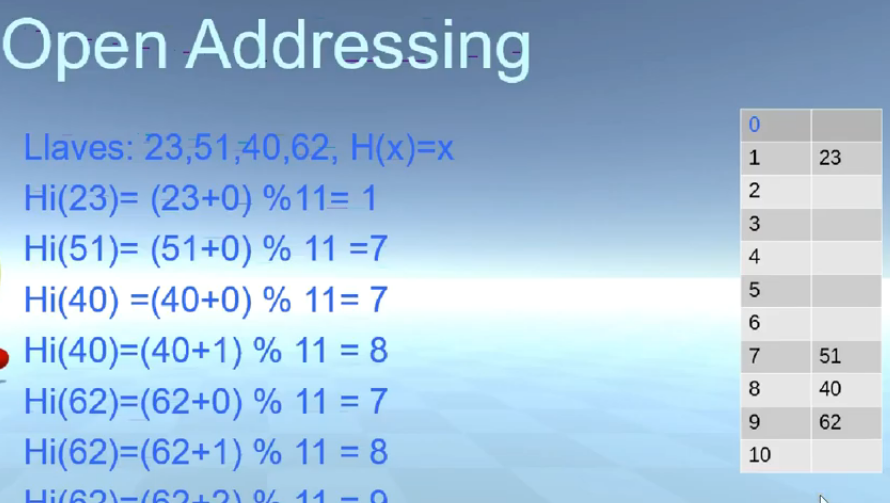

# Open Addressing
El direccionamiento abierto es otra tecnica por medio de la cual se resuelve el problema de las colisiones, este no lleva lista ligadas, si no que todos los elementos quedan adentro de la misma tabla.

El tamano de la tabla se recomienda sea mayor a la cantidad de elementos.

Por medio de la funcion Hash, obtenemos varios indices donde colocar el elemento en caso de tener colision.

Linear Probing 
- hi(x)= (h(x)+ i) % n
si hay colision, en la mayoria de los casos obtenemos la celda siguiente.

las celdas tienen tres estados posibles
* Vacio.
* Ocupado.
* Borrado.

