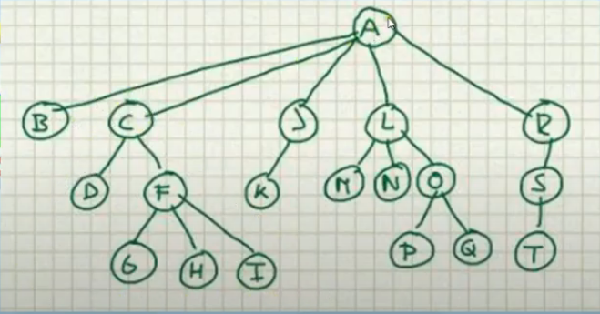

# ESTRUCTURA DE DATOS ARBOL
ES UNA COLECCION DE NODOS, TIENE UN NODO LLAMADO RAIZ Y CERO O MAS SUARBOLES CONECTADOS A LA RAIZ
POR ARISTAS.
- SI HAY N NODOS ENTONCES HAY N-1 ARISTAS.

- LA RAIZ ES EL PADRE DE LOS SUBARBOLES.
- LA RAIZ DE CADA SUBARBOL ES HIJA DE LA RAIZ
- LOS NODOS QUE NO TENGAN HIJOS SE LLAMAN HOJAS.
- LOS NODOS CON EL MISMO PADRE SE LLAMAN HERMANOS.
- EL PATH/RUTA ES LA SECUENCIA DE NODOS PARA IR DE UN NODO A OTRO.
- LA LONGITUD DE LA RUTA ES LA CANTIDAD DE ARISTAS QUE TIENE.
- LA PROFUNDIDAD DE UN NODO ES LA LONGITUD DE LA RUTA DESDE LA RAIZ HASTA ESE NODO
- LA RAIZ TIENE UNA PROFUNDIDAD DE 0
- LA ALTURA ES LA LONGITUD DE LA RUTA MAS LARGA DEL NODO A UNA HOJA. LAS HOJAS TIENEN ALTURA DE 0.
- LA ALTURA DEL ALBOL ES IGUAL A LA ALTURA DE LA RAIZ.