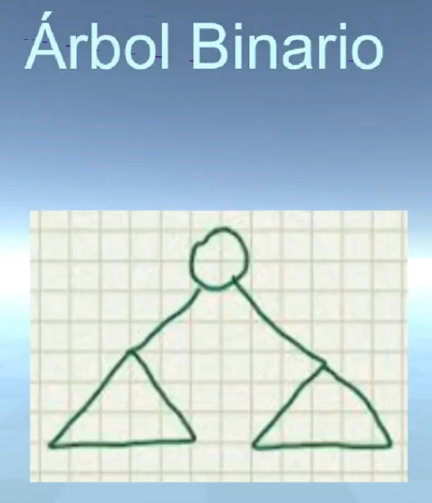
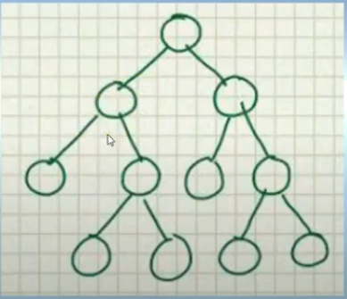
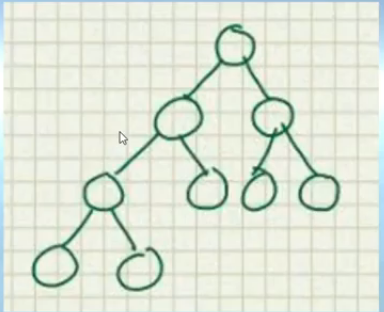
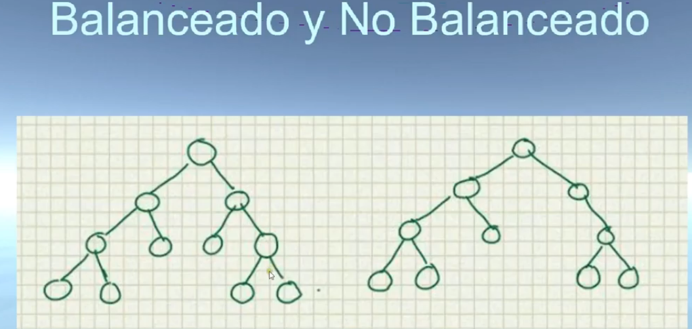
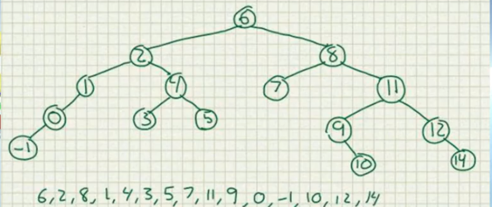

# Arbol Binario
-- Entendiendo el arbol binario.
hay muchos tipos de arbol binario. pero de manera general, el arbol binario 1 nodo puede tener un maximo de dos hijos. y cada hijo su propio sub arbol. casi siempre se llamara hijos izquiero o hijo derecho.

### Arbol estricto o propio
-- cada nodo tiene 2 o 0 hijos.

### Completo.
-- todos los niveles excepto pero posiblemente el ultimo estan completos y los nodos estan tan a la izquiera como sea posile.

### Perfecto
-- Todos los niveles estan completos

### balanceado y no balanceado.
- La diferenca de altura en el subarbol izquierda y derecho po cada nodo no es mayor a 1

# Arbol Binario de Busqueda y Transversa.

### Entendiendo el albol binario de busqueda 
- tiene una caracteristica importante, cuando se tiene un nodo, todos los que tengan un valor menor del que tenemos se escontraran al lado izquierdo, y todos los que tengan un valor mayor se encontrarar a la derecha. y debe existir esa caracteristica en todos sus nodos, para ser considerado un arbol binario de busqueda.
### Transversa
- 
### Breadth First
-- Todos los nodos que pertenecen al nivel se procesan antes de pasar al siguiente nivel.
### Depth First
-- se procesa la estructura completa del hijo antes de ir con el siguiente hijo.
-- hay seis posibles casos, pero los mas usados son:
#### PreoOrder -> R->I->D
#### InOrder -> I->R->D
#### PostOrder -> I->D->R