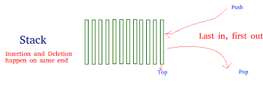
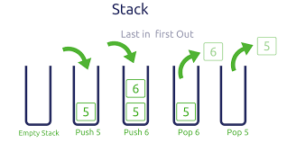

# Entendiendo el Stack

Las estructuras de datos no solo es contener la informacion, si no, tambien conocer las operaciones que lleva a cabo esa estructuras de datos y como esa uninon entro los datos y las operaciones que se pueden realizar entre los datos que se estar guardandando nos ayudara a resorver ciertos problemas. si las conocemos bien, resolveremos problemas de forma mas sencilla.

Las pilas colocamos un objeto encima de otro objeto, de tal forma que si deseamos usar uno de los elementos de esa pila tenemos que ir sacando los elementos superirores para llegar al que queremos. esto se conoce como first input last output(filo),

 

El stack  tiene dos operaciones basicas.

## Push Method
- push nosotros colocamos nuevos elementos en la pila.

## Pop Method

 - pop va a tomar el elemento que esta mas arriba de la pila y lo saca.

## Peek Metdho
este elemento nos permite observar ele elemento que esta mas arriba pero no lo saca.

existen metodos complementarios. como cantidad de elementos, limpiar la pila etc.